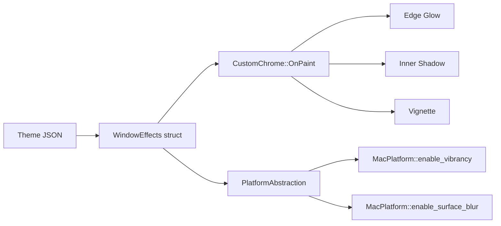

# Window Visual Effects System

MarkAmp implements a comprehensive window-level visual effects pipeline through the `WindowEffects` struct. Effects are theme-driven, serialized in JSON, and rendered per-frame by `CustomChrome`. Platform-specific features (frosted glass, surface blur) delegate to native APIs through `PlatformAbstraction`.

---

## Architecture



| Layer         | File                                 | Responsibility                                                     |
| ------------- | ------------------------------------ | ------------------------------------------------------------------ |
| Data Model    | `src/core/Theme.h`                   | `WindowEffects` struct definition with defaults                    |
| Serialization | `src/core/Theme.cpp`                 | JSON `to_json`/`from_json` + backward compat migration             |
| Rendering     | `src/ui/CustomChrome.cpp`            | Draws edge glow, inner shadow, vignette via wxDC/wxGraphicsContext |
| Platform API  | `src/platform/PlatformAbstraction.h` | Virtual `enable_vibrancy()` and `enable_surface_blur()`            |
| macOS Impl    | `src/platform/MacPlatform.mm`        | `NSVisualEffectView` behind-window and within-window blending      |

---

## Effects Reference

### 1. Frosted Glass (macOS Only)

Applies a system-level blur behind the entire window content using `NSVisualEffectView` with `NSVisualEffectBlendingModeBehindWindow`.

| Property        | Type   | Default | Description                           |
| --------------- | ------ | ------- | ------------------------------------- |
| `frosted_glass` | `bool` | `false` | Enable/disable frosted glass vibrancy |

**Platform Behavior:**

- **macOS**: Inserts an `NSVisualEffectView` with `NSVisualEffectMaterialHUDWindow` behind all content subviews. The view auto-resizes with the window. Identified via `NSUserInterfaceItemIdentification.identifier = "markamp.vibrancy"`.
- **Windows/Linux**: No-op (virtual method returns without action).

```json
{
  "effects": {
    "frosted_glass": true
  }
}
```

---

### 2. Inner Shadow

Draws concentric inset rectangles along the window chrome edges with progressively decreasing opacity, creating a subtle depth/shadow illusion.

| Property              | Type      | Default | Range  | Description                               |
| --------------------- | --------- | ------- | ------ | ----------------------------------------- |
| `inner_shadow`        | `bool`    | `false` | —      | Enable/disable inner shadow               |
| `inner_shadow_radius` | `int`     | `3`     | 1–8 px | Number of concentric shadow layers        |
| `inner_shadow_alpha`  | `uint8_t` | `40`    | 0–255  | Base alpha for the outermost shadow layer |

**Rendering Algorithm:**

```
for layer in 0..radius:
    alpha = base_alpha × (radius - layer) / radius
    draw_rectangle(layer, layer, w - 2*layer, h - 2*layer) with rgba(0,0,0, alpha)
```

The outermost layer is darkest; each successive inset layer fades towards fully transparent.

```json
{
  "effects": {
    "inner_shadow": true,
    "inner_shadow_radius": 5,
    "inner_shadow_alpha": 60
  }
}
```

---

### 3. Edge Glow

Draws a multi-layer colored border along all four window edges. Supersedes the legacy `neon_edge` boolean.

| Property          | Type      | Default   | Range   | Description                             |
| ----------------- | --------- | --------- | ------- | --------------------------------------- |
| `edge_glow`       | `bool`    | `false`   | —       | Enable/disable edge glow                |
| `edge_glow_color` | `Color`   | `#6463FF` | Any RGB | Glow color (hex string in JSON)         |
| `edge_glow_width` | `int`     | `1`       | 1–4 px  | Number of border layers                 |
| `edge_glow_alpha` | `uint8_t` | `60`      | 0–255   | Base alpha for the outermost glow layer |

**Rendering Algorithm:**

```
for layer in 0..width:
    alpha = base_alpha × (width - layer) / width
    draw top/left/right/bottom lines at inset = layer with rgba(color, alpha)
```

The outermost layer has full specified alpha; inner layers dim progressively, creating a soft glow.

```json
{
  "effects": {
    "edge_glow": true,
    "edge_glow_color": "#6C63FF",
    "edge_glow_width": 2,
    "edge_glow_alpha": 80
  }
}
```

---

### 4. Vignette

Applies linear gradient darkening strips along all four window edges using `wxGraphicsContext`. Creates a subtle cinematic/photographic darkening effect at the periphery.

| Property            | Type      | Default | Range | Description                             |
| ------------------- | --------- | ------- | ----- | --------------------------------------- |
| `vignette`          | `bool`    | `false` | —     | Enable/disable vignette                 |
| `vignette_strength` | `uint8_t` | `30`    | 0–255 | Maximum alpha of the darkening gradient |

**Rendering Geometry:**

- **Top/Bottom strips**: height = `window_height / 6`, gradient from `rgba(0,0,0, strength)` → transparent
- **Left/Right strips**: width = `window_width / 8`, gradient from `rgba(0,0,0, strength)` → transparent

Uses `wxGraphicsContext::CreateLinearGradientBrush` for smooth hardware-accelerated alpha blending.

```json
{
  "effects": {
    "vignette": true,
    "vignette_strength": 50
  }
}
```

---

### 5. Surface Blur (macOS Only)

Applies a within-window frosted blur effect using `NSVisualEffectView` with `NSVisualEffectBlendingModeWithinWindow`. Useful for creating glassmorphism on panel dividers and overlays.

| Property       | Type   | Default | Description                               |
| -------------- | ------ | ------- | ----------------------------------------- |
| `surface_blur` | `bool` | `false` | Enable/disable within-window surface blur |

**Platform Behavior:**

- **macOS**: Inserts an `NSVisualEffectView` with `NSVisualEffectMaterialSidebar` and within-window blending. Identified via `identifier = "markamp.surfaceblur"`.
- **Windows/Linux**: No-op.

```json
{
  "effects": {
    "surface_blur": true
  }
}
```

---

## Full JSON Schema

All effects are nested under the `"effects"` key in a theme JSON file. Every property is optional; omitted properties fall back to their struct defaults.

```json
{
  "id": "my-theme",
  "name": "My Theme",
  "colors": { "...": "..." },
  "effects": {
    "frosted_glass": false,
    "inner_shadow": false,
    "inner_shadow_radius": 3,
    "inner_shadow_alpha": 40,
    "edge_glow": false,
    "edge_glow_color": "#6463FF",
    "edge_glow_width": 1,
    "edge_glow_alpha": 60,
    "vignette": false,
    "vignette_strength": 30,
    "surface_blur": false
  }
}
```

---

## Backward Compatibility

### Legacy `neon_edge` Migration

Themes created before Phase 4D+ used a simple `"neon_edge": true` flag. The migration is handled automatically:

1. **On JSON load**: `from_json` reads `"neon_edge"` into `Theme::neon_edge` if present.
2. **On layer sync**: `sync_layers_from_colors()` checks `neon_edge && !effects.edge_glow` and, if true, enables `effects.edge_glow` and copies `colors.accent_primary` to `effects.edge_glow_color`.
3. Existing `effects.edge_glow` settings are **never overwritten** — explicit effects take priority.

```cpp
// Theme.cpp — sync_layers_from_colors()
if (neon_edge && !effects.edge_glow)
{
    effects.edge_glow = true;
    effects.edge_glow_color = colors.accent_primary;
}
```

---

## Rendering Pipeline

Effects are painted in `CustomChrome::OnPaint` after the background/gradient but before UI elements (logo, title text, buttons, file pill).

```
OnPaint()
  ├── Background (solid or gradient)
  ├── ███ Edge Glow (if effects.edge_glow)
  ├── ███ Inner Shadow (if effects.inner_shadow)
  ├── ███ Vignette (if effects.vignette)
  ├── Logo dot + title text
  ├── File pill
  ├── Separator
  ├── Mode buttons (SRC / SPLIT / VIEW)
  └── Close button
```

The rendering order ensures effects layer under interactive elements.

---

## Platform API

The `PlatformAbstraction` base class exposes two virtual methods for platform-specific effects:

```cpp
// PlatformAbstraction.h
virtual void enable_vibrancy(wxFrame* frame, bool enable)    { /* no-op */ }
virtual void enable_surface_blur(wxFrame* frame, bool enable) { /* no-op */ }
```

Only `MacPlatform` overrides these. On Windows and Linux, them remain no-ops. Each override manages an `NSVisualEffectView` lifecycle:

- **Create**: Allocates and inserts behind all subviews on `enable = true` (idempotent — checks by `identifier`)
- **Destroy**: Removes from superview on `enable = false`
- **Identity**: Uses `NSUserInterfaceItemIdentification.identifier` for subview lookup (not `tag`)

---

## Testing

10 dedicated unit tests in `tests/unit/test_theme_phase4.cpp` tagged `[phase4d]`:

| Test                            | Assertion Count | Verifies                                |
| ------------------------------- | --------------- | --------------------------------------- |
| All effects disabled by default | 5               | Default booleans                        |
| Default parameter values        | 8               | Radius, alpha, width, strength defaults |
| Equality comparison             | 2               | `operator==` default generation         |
| Edge glow color breaks equality | 1               | Color field included in comparison      |
| JSON round-trip via Theme       | 13              | Full serialize → deserialize fidelity   |
| neon_edge → edge_glow migration | 3               | Backward compat auto-migration          |
| neon_edge no override           | 3               | Existing edge_glow preserved            |
| Theme effects default disabled  | 5               | Field initialization in Theme struct    |

**Run:**

```bash
./build/tests/test_theme_phase4 --reporter compact
# All tests passed (97 assertions in 25 test cases)
```

---

## Example: Cyberpunk Theme

```json
{
  "id": "cyberpunk",
  "name": "Cyberpunk Neon",
  "colors": {
    "--bg-app": "#0A0A1A",
    "--bg-panel": "#111128",
    "--accent-primary": "#FF00FF",
    "...": "..."
  },
  "effects": {
    "frosted_glass": true,
    "edge_glow": true,
    "edge_glow_color": "#FF00FF",
    "edge_glow_width": 3,
    "edge_glow_alpha": 100,
    "inner_shadow": true,
    "inner_shadow_radius": 4,
    "inner_shadow_alpha": 60,
    "vignette": true,
    "vignette_strength": 45,
    "surface_blur": true
  }
}
```

---

## Source Files

| File                                 | Lines     | Purpose                                           |
| ------------------------------------ | --------- | ------------------------------------------------- |
| `src/core/Theme.h`                   | L125–L150 | `WindowEffects` struct definition                 |
| `src/core/Theme.cpp`                 | L247–L309 | JSON serialization + backward compat              |
| `src/ui/CustomChrome.cpp`            | L278–L373 | Edge glow, inner shadow, vignette rendering       |
| `src/platform/PlatformAbstraction.h` | L96–L118  | Virtual `enable_vibrancy` / `enable_surface_blur` |
| `src/platform/MacPlatform.h`         | L35–L37   | Override declarations                             |
| `src/platform/MacPlatform.mm`        | L203–L276 | NSVisualEffectView implementation                 |
| `tests/unit/test_theme_phase4.cpp`   | L219–L359 | WindowEffects unit tests                          |
