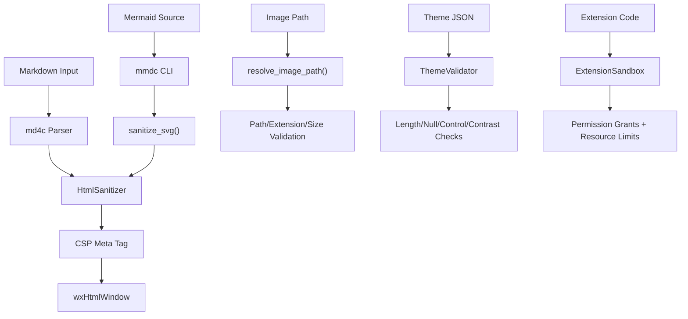

# Security

> Security controls, threat model, encryption, and access controls for MarkAmp v2.3.16.

---

## Threat Model

MarkAmp is a **desktop application** that renders user-supplied Markdown, manages local files, and optionally syncs to cloud services. The primary threat vectors are:

| Vector                               | Risk     | Status                             |
| ------------------------------------ | -------- | ---------------------------------- |
| XSS via injected HTML/JS in Markdown | Critical | ✅ Mitigated (HtmlSanitizer + CSP) |
| SVG injection via Mermaid output     | High     | ✅ Mitigated (sanitize_svg)        |
| Path traversal via image references  | High     | ✅ Mitigated (resolve_image_path)  |
| Remote resource loading              | Medium   | ✅ Blocked (CSP)                   |
| Theme file injection                 | Medium   | ✅ Validated (ThemeValidator)      |
| CSS injection via style attributes   | Medium   | ✅ Filtered (HtmlSanitizer)        |
| Extension sandbox escape             | Medium   | ✅ Mitigated (ExtensionSandbox)    |
| Credential exposure                  | Medium   | ✅ Encrypted (EncryptionService)   |
| DoS via large/nested input           | Low      | ✅ Handled (input limits)          |

---

## Defense-in-Depth Architecture



---

## Security Controls

### 1. HTML Sanitization (`HtmlSanitizer`)

**Approach:** Whitelist-based tag and attribute filtering.

**Allowed tags:** Standard Markdown output elements (p, h1–h6, pre, code, table, a, img, ul, ol, li, blockquote, hr, br, etc.) plus safe SVG elements.

**Blocked:**

- Tags: `script`, `style`, `link`, `meta`, `base`, `iframe`, `object`, `embed`, `form`, `button`, `textarea`, `select`, `applet`
- Attributes: All `on*` event handlers
- URI schemes: `javascript:`, `vbscript:`, `data:text/html`
- CSS: `expression()`, `url()`, `behavior`, `binding`, `-moz-binding`

### 2. Content Security Policy

Injected into every preview page:

```
default-src 'none'; script-src 'none'; style-src 'unsafe-inline';
img-src data: file:; font-src 'none'; connect-src 'none';
frame-src 'none'; object-src 'none';
```

### 3. File Access Restrictions

`resolve_image_path()` enforces:

- Remote URL blocking (http, https, ftp, data)
- Path traversal prevention (canonical path must be under base dir)
- Extension whitelist (.png, .jpg, .jpeg, .gif, .bmp, .svg, .webp)
- File size limit (`kMaxImageFileSize`)

### 4. SVG Sanitization

Applied to all Mermaid CLI output:

- Strips `<script>`, `<foreignObject>` tags
- Removes `on*` event handler attributes
- Case-insensitive matching

### 5. Input Validation

Theme/config validation:

- String length limits (name ≤ 100, id ≤ 64 chars)
- Null byte detection
- Control character rejection (< 0x20 except tab/newline/CR, and 0x7F)
- Color value validation

---

## Encryption

### EncryptionService

- **Algorithm:** AES-256-CBC (via OpenSSL)
- **Key Management:** `KeyManager` with platform-native keychain where available
- **Use Cases:**
  - Vault encryption (`VaultService`, `VaultEncryptionManager`)
  - Extension secret storage (`ExtensionStorage`)
  - Cloud sync credentials
  - API keys (AI providers)

### Vault System

- Encrypted vault files with per-vault keys
- Vault locking/unlocking lifecycle
- Session-based key caching (cleared on lock)

---

## Extension Sandbox (`ExtensionSandbox`)

### Permission Model

| Permission           | Controls         | Default |
| -------------------- | ---------------- | ------- |
| `kFileSystem`        | File read/write  | Denied  |
| `kNetwork`           | Outbound HTTP    | Denied  |
| `kTerminal`          | Process spawning | Denied  |
| `kWorkspaceSettings` | Config changes   | Denied  |
| `kClipboard`         | Clipboard access | Denied  |

Extensions must declare required permissions in their manifest. Users are prompted to grant permissions on first use.

### Resource Limits

- Memory budget per extension (`PluginMemoryTracker`)
- Crash count tracking with automatic quarantine (`PluginQuarantine`)
- Safe call wrappers with exception isolation (`PluginSafeCall`)
- Host recovery on crash (`ExtensionHostRecovery`)

---

## Enterprise Security (`RuntimePolicy`)

- Immutable configuration enforcement
- Network access control lists
- Extension allowlist/blocklist
- Audit logging (`SecurityAuditLog`)

---

## Data Protection

### PII Redaction (`DataRedactionEngine`)

- Configurable redaction rules
- Pattern-based detection (email, phone, SSN, etc.)
- Preview before export

### URL/Clipboard Sanitization

- `UrlSanitizer` — validates and sanitizes URLs before navigation
- `ClipboardSanitizer` — sanitizes clipboard content on paste

---

## Safe Mode (`SafeMode`)

Multi-tier recovery:

| Tier | Trigger            | Action                           |
| ---- | ------------------ | -------------------------------- |
| 1    | Single crash       | Restart with extensions disabled |
| 2    | Repeated crashes   | Disable custom themes            |
| 3    | Persistent crashes | Reset configuration to defaults  |
| 4    | Unrecoverable      | Minimal mode (editor only)       |

---

## Audit & Compliance

### Security Audit Log

`SecurityAuditLog` records:

- Extension install/uninstall
- Permission grants
- Vault lock/unlock events
- Configuration changes
- Authentication events

### Content Security Policy Compliance

The CSP prevents:

- JavaScript execution in preview
- Remote resource loading
- Frame embedding
- Plugin execution

---

## Dependency Security

- Dependencies managed via vcpkg with version pinning
- No npm/node runtime dependencies
- OpenSSL for cryptographic operations (no custom crypto)
- All third-party code in `external/` and vendored via vcpkg

### Vulnerability Scanning

```bash
# Check vcpkg dependencies for known vulnerabilities
cd external/vcpkg && git pull  # Update port files
cmake --preset debug           # Rebuild with latest deps
```

---

## Secrets Handling

- **No credentials committed** to the repository
- API keys encrypted at rest via `EncryptionService`
- Extension secrets in per-extension encrypted storage
- Cloud sync credentials in platform keychain
- `.env` files are not used (desktop application)

→ See [Security Audit](security_audit.md) for detailed test coverage of security controls.
