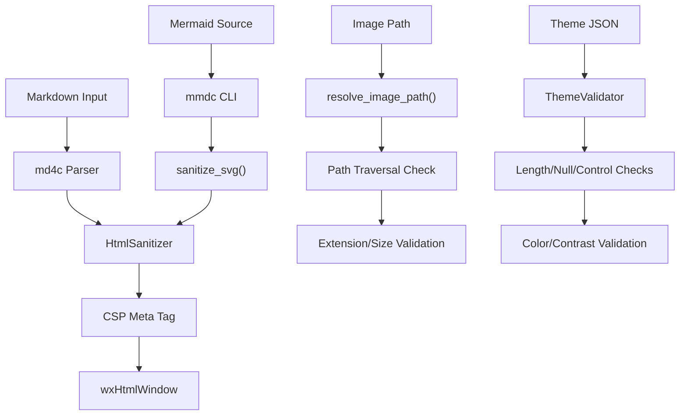

# Security Audit — MarkAmp

## Threat Model

MarkAmp renders user-supplied Markdown content. The primary threat vectors are:

| Vector                                              | Risk Level   | Status       |
| --------------------------------------------------- | ------------ | ------------ |
| XSS via injected HTML/JS in Markdown                | **Critical** | ✅ Mitigated |
| SVG injection via Mermaid output                    | **High**     | ✅ Mitigated |
| Path traversal via image references                 | **High**     | ✅ Mitigated |
| Remote resource loading                             | **Medium**   | ✅ Blocked   |
| Theme file injection (null bytes, overlong strings) | **Medium**   | ✅ Validated |
| CSS injection via style attributes                  | **Medium**   | ✅ Filtered  |
| DoS via deeply nested/large input                   | **Low**      | ✅ Handled   |

## Security Controls

### 1. HTML Sanitizer (`HtmlSanitizer.h/.cpp`)

**Approach:** Whitelist-based tag and attribute filtering applied as defense-in-depth after `md4c` parsing.

- **Allowed tags:** Only standard Markdown output elements (p, h1–h6, pre, code, table, a, img, ul, ol, li, blockquote, hr, br, etc.) plus safe SVG elements.
- **Blocked tags:** `script`, `style`, `link`, `meta`, `base`, `iframe`, `object`, `embed`, `form`, `button`, `textarea`, `select`, `applet`.
- **Attribute filtering:**
  - All `on*` event handler attributes are stripped.
  - `javascript:`, `vbscript:`, and `data:text/html` URIs are blocked in `href`/`src`.
  - `style` attributes are sanitized: `expression()`, `url()`, `behavior`, `binding`, `-moz-binding` are removed.
- **Input types:** Only `<input type="checkbox">` is allowed (for GFM task lists).

### 2. Content Security Policy (`PreviewPanel.cpp`)

CSP meta tag injected into every rendered page:

```
default-src 'none'; script-src 'none'; style-src 'unsafe-inline';
img-src data: file:; font-src 'none'; connect-src 'none';
frame-src 'none'; object-src 'none';
```

This blocks all script execution and remote resource loading at the browser engine level.

### 3. Mermaid SVG Sanitization (`MermaidRenderer.cpp`)

**`sanitize_svg()`** is applied to all mmdc output before caching:

- Strips `<script>`, `</script>`, `<foreignObject>`, `</foreignObject>` tags.
- Removes `on*` event handler attributes from all SVG elements.
- Case-insensitive matching prevents bypass via mixed case.

### 4. File Access Restrictions (`HtmlRenderer.cpp`)

**`resolve_image_path()`** enforces:

- Remote URL blocking: `http://`, `https://`, `ftp://`, `data:` schemes return empty path.
- Path traversal prevention: After `weakly_canonical()`, verifies the resolved path starts with the base directory.
- Extension whitelist: Only `.png`, `.jpg`, `.jpeg`, `.gif`, `.bmp`, `.svg`, `.webp` are allowed.
- File size limit: Images exceeding `kMaxImageFileSize` are rejected.

### 5. Input Validation (`ThemeValidator.h/.cpp`)

Theme files are validated with:

- **String length limits:** `name` ≤ 100 chars, `id` ≤ 64 chars.
- **Null byte detection:** Strings containing `\0` are rejected.
- **Control character rejection:** Characters < 0x20 (except tab, newline, CR) and DEL (0x7F) are rejected.
- **Color validation:** All color values must parse as valid `#RRGGBB` or `#RRGGBBAA` hex strings.
- **Contrast ratio checks:** WCAG AA minimum 4.5:1 ratio warnings.

## Test Coverage

Security tests in `test_security.cpp` cover:

| Category             | Test Count | Vectors                                                             |
| -------------------- | ---------- | ------------------------------------------------------------------- |
| XSS – Script tags    | 3          | Basic, attributed, mixed-case                                       |
| XSS – Event handlers | 4          | onclick, onerror, onload, onmouseover                               |
| XSS – URI schemes    | 3          | javascript:, vbscript:, whitespace-padded                           |
| Dangerous tags       | 8          | iframe, object, embed, form, style, link, meta, base, foreignObject |
| Style injection      | 4          | expression(), url(), behavior, safe passthrough                     |
| data: URI            | 2          | text/html, image/svg                                                |
| Safe passthrough     | 7          | Markdown output, code, tables, links, images, checkbox              |
| SVG sanitization     | 3          | Script removal, foreignObject removal, on\* stripping               |
| Path traversal       | 4          | http, https, ftp, data: blocking                                    |
| Input validation     | 3          | Length limit, null bytes, control characters                        |
| DoS resistance       | 2          | Deep nesting (1000 levels), large input (1MB)                       |
| Edge cases           | 5          | Empty, plain text, unclosed tag, malformed tag, comments            |

## Known Limitations

> [!IMPORTANT]
> The HTML sanitizer uses simple string-based parsing, not a full DOM parser. While effective against common XSS vectors, extremely exotic payloads with unusual encoding or parser differentials could theoretically bypass it. The CSP meta tag provides a critical second defense layer.

- The sanitizer does not handle HTML entity-encoded payloads (e.g., `&#x3C;script>`). However, `md4c` does not produce such output, and the CSP blocks script execution regardless.
- Mermaid rendering relies on the external `mmdc` CLI tool. If a malicious mmdc binary is installed, it could produce arbitrary output. The `sanitize_svg()` layer mitigates this.
- The CSP is enforced by `wxHtmlWindow`'s HTML rendering engine, which may not support all CSP directives. Script execution is inherently limited in wxWidgets' HTML widget.

## Defense-in-Depth Architecture



Each layer independently prevents attacks, so a bypass at one layer is caught by the next.
