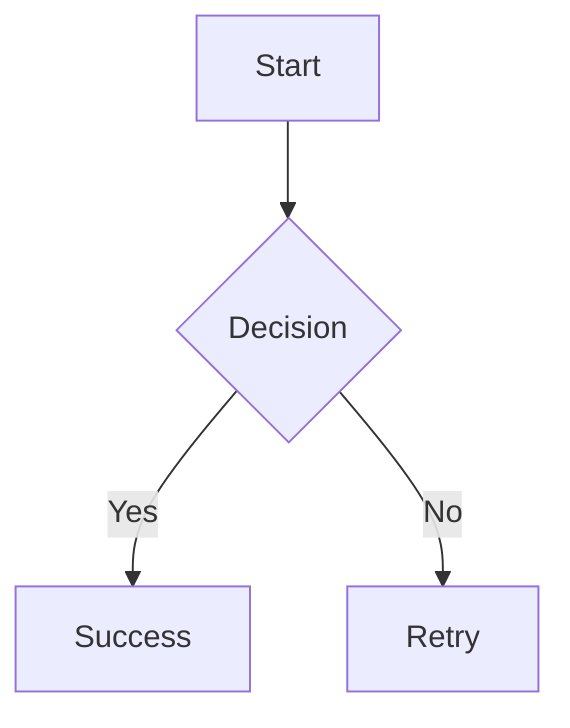

# MarkAmp User Guide

Welcome to **MarkAmp** — a cross-platform Markdown editor built for speed, beauty, and full offline operation. This guide covers everything you need to get started and master the application.

---

## 1. Getting Started

### Installation

**macOS:**

- **Direct download:** Open the `.dmg`, drag _MarkAmp_ into _Applications_.
- **Mac App Store:** Search "MarkAmp" in the Mac App Store and install.

**Windows:**

- **Installer:** Run `MarkAmp-Setup.exe` and follow the wizard.
- **Portable:** Extract the ZIP to any folder and run `markamp.exe`.
- **Microsoft Store:** Search "MarkAmp" in the Microsoft Store.

**Linux:**

- **Debian/Ubuntu:** `sudo dpkg -i markamp_*.deb`
- **AppImage:** `chmod +x MarkAmp-*.AppImage && ./MarkAmp-*.AppImage`
- **Tarball:** Extract and run `./markamp`

### First Launch

When you first open MarkAmp you will see:

- The **Midnight Neon** theme applied (dark blue/cyan palette)
- A **sidebar** on the left with sample files
- The **split view** showing your editor on the left and live preview on the right
- A **status bar** at the bottom showing cursor position, encoding, and theme name

### Opening Files

- **Single file:** `File → Open` or drag a `.md` file onto the window
- **Folder:** `File → Open Folder` (Ctrl+Shift+O) to browse a project directory
- **Recent files:** Listed in the File menu

---

## 2. The Editor

### Writing Markdown

The editor provides a rich editing experience with:

- **Syntax highlighting** for Markdown elements
- **Line numbers** in the gutter
- **Bracket matching** for `()`, `[]`, `{}`
- **Auto-indent** for list items and structured content
- **Word wrap** (toggleable)

### View Modes

| Mode      | Shortcut | Description                        |
| --------- | -------- | ---------------------------------- |
| **SRC**   | Ctrl+1   | Editor only                        |
| **SPLIT** | Ctrl+2   | Editor + live preview side-by-side |
| **VIEW**  | Ctrl+3   | Preview only                       |

Click the mode buttons in the toolbar or use keyboard shortcuts.

### Find and Replace

| Action         | Shortcut               |
| -------------- | ---------------------- |
| Find           | Ctrl+F                 |
| Replace        | Ctrl+H                 |
| Find next      | Enter / F3             |
| Find previous  | Shift+Enter / Shift+F3 |
| Close find bar | Escape                 |

### Undo / Redo

| Action | Shortcut     |
| ------ | ------------ |
| Undo   | Ctrl+Z       |
| Redo   | Ctrl+Shift+Z |

---

## 3. Markdown Features

MarkAmp supports the full **GitHub Flavored Markdown** spec:

| Element         | Syntax                         |
| --------------- | ------------------------------ | --- | --- | ------ | --- | --- | ----------- |
| Headings        | `# H1` through `###### H6`     |
| Bold            | `**bold**`                     |
| Italic          | `*italic*`                     |
| Strikethrough   | `~~deleted~~`                  |
| Ordered list    | `1. Item`                      |
| Unordered list  | `- Item`                       |
| Task list       | `- [x] Done` / `- [ ] Todo`    |
| Blockquote      | `> Quote text`                 |
| Code (inline)   | `` `code` ``                   |
| Code block      | ` ```lang ... ``` `            |
| Table           | `                              | A   | B   | `with` | --- | --- | ` separator |
| Link            | `[text](url)`                  |
| Image           | ``                 |
| Horizontal rule | `---`                          |
| Footnote        | `[^1]` with `[^1]: definition` |

### Mermaid Diagrams

MarkAmp renders [Mermaid](https://mermaid.js.org) diagrams inline:

````

````

If the syntax has errors, an error overlay appears in the preview with a description of the issue. Fix the syntax and the diagram re-renders automatically.

### Syntax Highlighting

Code blocks support 15+ languages including: C, C++, Python, JavaScript, TypeScript, Rust, Go, Java, Ruby, Shell, SQL, JSON, YAML, HTML, CSS, and Markdown.

---

## 4. Themes

### Built-in Themes

| Theme              | Description                           |
| ------------------ | ------------------------------------- |
| Midnight Neon      | Dark blue with cyan accents (default) |
| Cyber Night        | Deep purple with neon green           |
| Solarized Dark     | Warm amber on dark grey               |
| Classic Mono       | Clean monochrome                      |
| High Contrast Blue | WCAG accessible, bold blue            |
| Matrix Core        | Green-on-black terminal style         |
| Classic Amp        | Retro amplifier aesthetic             |
| Vapor Wave         | Pink/purple synthwave palette         |

### Switching Themes

1. Click the **theme button** in the toolbar (or press the theme shortcut)
2. The **Theme Gallery** opens showing all available themes
3. Click any theme card to apply it instantly
4. Press **Escape** to close the gallery

### Import / Export

- **Export:** In the gallery, click the export icon on a theme card. A `.json` file is saved.
- **Import:** Click the import button in the gallery and select a `.json` theme file.

### Custom Themes

Create a JSON file with the following structure and import it:

```json
{
  "id": "my-theme",
  "name": "My Custom Theme",
  "colors": {
    "--bg-app": "#1a1a2e",
    "--bg-panel": "#1f1f3a",
    "--text-main": "#e0e0e0",
    "--accent-primary": "#ff6b9d"
  }
}
```

See `docs/api_reference.md` for the complete list of color keys.

---

## 5. Keyboard Shortcuts

### File Operations

| Action      | macOS | Windows / Linux |
| ----------- | ----- | --------------- |
| New file    | ⌘N    | Ctrl+N          |
| Open file   | ⌘O    | Ctrl+O          |
| Open folder | ⌘⇧O   | Ctrl+Shift+O    |
| Save        | ⌘S    | Ctrl+S          |
| Save As     | ⌘⇧S   | Ctrl+Shift+S    |

### Editing

| Action     | macOS | Windows / Linux |
| ---------- | ----- | --------------- |
| Undo       | ⌘Z    | Ctrl+Z          |
| Redo       | ⌘⇧Z   | Ctrl+Shift+Z    |
| Find       | ⌘F    | Ctrl+F          |
| Replace    | ⌘H    | Ctrl+H          |
| Select All | ⌘A    | Ctrl+A          |

### View

| Action         | macOS | Windows / Linux |
| -------------- | ----- | --------------- |
| Source view    | ⌘1    | Ctrl+1          |
| Split view     | ⌘2    | Ctrl+2          |
| Preview view   | ⌘3    | Ctrl+3          |
| Toggle sidebar | ⌘B    | Ctrl+B          |
| Shortcut help  | F1    | F1              |

### Navigation

| Action             | macOS  | Windows / Linux |
| ------------------ | ------ | --------------- |
| Cycle focus zones  | Tab    | Tab             |
| Navigate sidebar   | ↑ ↓    | ↑ ↓             |
| Open selected file | Enter  | Enter           |
| Close panel        | Escape | Escape          |

---

## 6. Settings

MarkAmp stores settings in a platform-appropriate location:

- **macOS:** `~/Library/Application Support/MarkAmp/config.json`
- **Windows:** `%APPDATA%\MarkAmp\config.json`
- **Linux:** `~/.config/MarkAmp/config.json`

Available settings:

| Key               | Type   | Default           | Description         |
| ----------------- | ------ | ----------------- | ------------------- |
| `theme`           | string | `"midnight-neon"` | Active theme ID     |
| `view_mode`       | string | `"split"`         | Default view mode   |
| `sidebar_visible` | bool   | `true`            | Sidebar visibility  |
| `word_wrap`       | bool   | `true`            | Word wrap in editor |
| `font_size`       | int    | `14`              | Editor font size    |
| `line_numbers`    | bool   | `true`            | Show line numbers   |

---

## 7. Troubleshooting

### Preview doesn't update

- Check that you're in **Split** or **Preview** mode
- The preview updates after a short debounce delay (typically 300ms)

### Mermaid diagrams don't render

- Ensure the code block uses the ` ```mermaid ` fence language tag
- Check for syntax errors — an error overlay will describe the issue

### Fonts look wrong

- MarkAmp bundles JetBrains Mono + Rajdhani fonts
- If they don't load, check that the `resources/fonts/` directory exists

### Application won't start

- **macOS:** Right-click → Open if Gatekeeper blocks it
- **Linux:** Ensure required libraries are installed: `libgtk-3.so`, `libwebkit2gtk-4.0.so`
- **Windows:** Install Visual C++ Redistributable if prompted

### Reporting Bugs

File issues at [github.com/markamp/markamp/issues](https://github.com/markamp/markamp/issues) with:

1. OS and version
2. Steps to reproduce
3. Expected vs actual behavior
4. Console output (if available)
