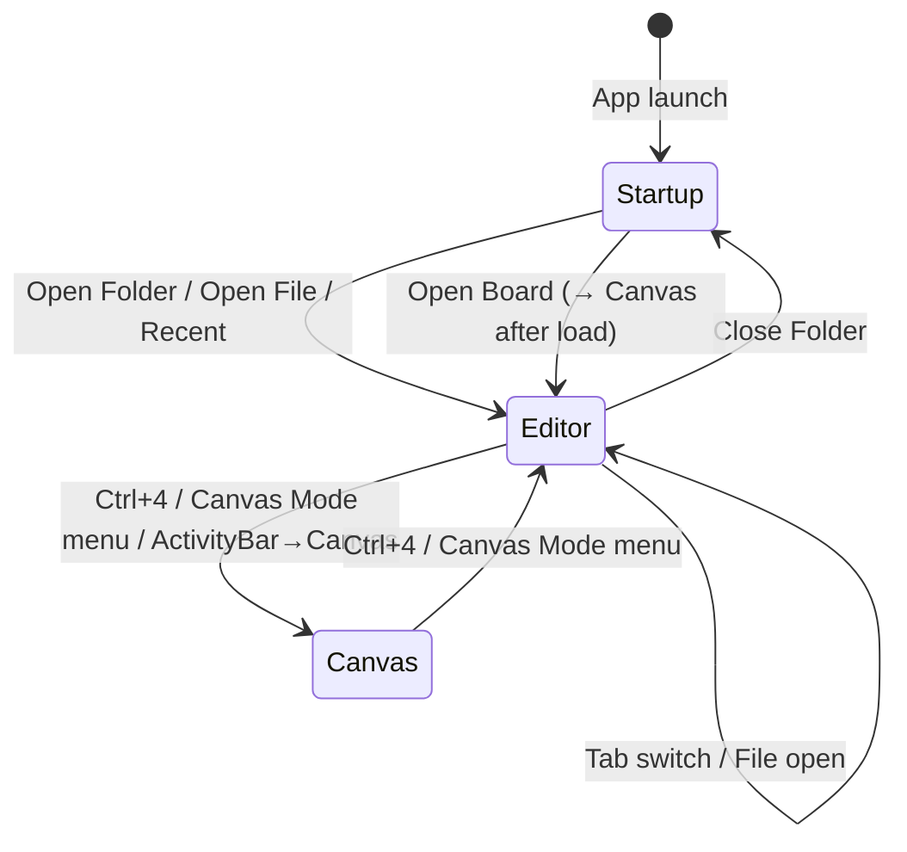

# P01-T04: Workbench Mode and Panel Lifecycle Contract

> **Phase 01 — Integration Inventory and Shared Contracts**
> **Status:** Complete
> **Scope:** Defines mode transitions, panel lifecycle, session restore, and state persistence rules.
> **Rollback:** Documentation only — no code changes.

---

## 1 · Workbench Modes

### 1.1 Mode Inventory

| Mode        | Entry Point                | Owner            | Source File                    |
|-------------|---------------------------|------------------|--------------------------------|
| **Startup** | `showStartupScreen()`     | `MainFrame`      | `MainFrame.cpp:2139`           |
| **Editor**  | `showEditor()`            | `MainFrame`      | `MainFrame.cpp:2154`           |
| **Canvas**  | `ShowCanvasWorkspace()`   | `LayoutManager`  | `LayoutManager.cpp`            |
| **Notebook**| (via ActivityBar)         | `LayoutManager`  | Not fully implemented          |

### 1.2 Transition Graph



### 1.3 Transition Implementations

| Transition       | Trigger                                      | Source Code                                |
|------------------|----------------------------------------------|------------------------------------------|
| `[*] → Startup`  | Constructor — default state                  | `MainFrame::MainFrame()` line 220–277    |
| `Startup → Editor`| `OpenFolderRequestEvent` / `WorkspaceOpenRequestEvent` / New File | `MainFrame::showEditor()` line 2154 |
| `Editor → Startup`| `kMenuCloseFolder` menu                     | `MainFrame::showStartupScreen()` line 2139 |
| `Editor ↔ Canvas` | `kMenuCanvasMode` / `ShowCanvasWorkspace()`  | `LayoutManager::ShowCanvasWorkspace()` / `ShowEditorWorkspace()` |

### 1.4 Gaps

| Gap | Description |
|-----|-------------|
| ⚠️ `restoreWindowState()` | Exists at `MainFrame.cpp` but the call is commented out (line 277). Window state is saved but never restored on startup. |
| ⚠️ Notebook mode | Activity bar has a "Notebooks" item but no `ShowNotebookWorkspace()` method exists on `LayoutManager`. |
| ⚠️ Menu bar state | `updateMenuBarForStartup()` and `updateMenuBarForEditor()` exist but the enable/disable calls are commented out (lines 2189–2206). |

---

## 2 · Panel Lifecycle

### 2.1 Panel Types

| Category         | Examples                                   | Manager               |
|-----------------|--------------------------------------------|-----------------------|
| **Sidebar panels** | Explorer, Search, Extensions, Git, AI   | `LayoutManager` → `ActivityBar` |
| **Bottom panels** | Terminal, Output, Problems, Build, Debug Console | `PanelAreaModel` / `PanelLifecycleManager` |
| **Floating**      | CommandPalette, PromptOverlay (future)   | `MainFrame` (direct ownership) |
| **Overlay**       | FindBar, TooltipWindow                   | Component-level       |

### 2.2 PanelLifecycleManager Contract

From `PanelLifecycleManager.cpp`:

```
PanelLayoutEntry {
    panel_id:       "explorer"
    display_name:   "Explorer"
    dock_position:  DockPosition::kLeft | kRight | kBottom
    visible:        true/false
    pinned:         true/false
    width:          260
    height:         600
    order:          0
}
```

**Operations:**
| Operation              | Method                                          |
|------------------------|-------------------------------------------------|
| Save snapshot          | `save_snapshot(name, entries)` — named layout   |
| Get snapshot           | `get_snapshot(name)` → `PanelSnapshot*`         |
| Delete snapshot        | `delete_snapshot(name)`                         |
| Set default layout     | `set_default_layout(entries)`                   |
| Get builtin defaults   | `builtin_defaults()` → 7 default panels        |

**Builtin Defaults:**
| Panel ID          | Label            | Position | Visible | Pinned |
|-------------------|------------------|----------|---------|--------|
| `explorer`        | Explorer         | Left     | ✅      | ✅     |
| `search`          | Search           | Left     | ❌      | ❌     |
| `output`          | Output           | Bottom   | ❌      | ❌     |
| `problems`        | Problems         | Bottom   | ❌      | ❌     |
| `terminal`        | Terminal         | Bottom   | ✅      | ✅     |
| `build`           | Build            | Bottom   | ❌      | ❌     |
| `debug_console`   | Debug Console    | Bottom   | ❌      | ❌     |

### 2.3 Panel Creation Rules

| Rule             | Description                                           |
|------------------|-------------------------------------------------------|
| **Lazy creation** | Bottom panels are created on first show, not at startup |
| **Eager creation**| Sidebar panels (Explorer, Search) created at startup  |
| **Extension**     | `CustomPanelRegisteredEvent` → add to ActivityBar     |
| **Removal**       | `CustomPanelUnregisteredEvent` → remove from ActivityBar |

---

## 3 · Session Restore

### 3.1 WorkspaceSessionRestore Contract

From `WorkspaceSessionRestore.cpp`:

```
SessionSnapshot {
    snapshot_id:     "snap_1"
    workspace_name:  "my-project"
    created_at:      timestamp
    open_files:      ["path/a.md", "path/b.md"]
}
```

**Operations:**
| Operation             | Method                                    |
|-----------------------|-------------------------------------------|
| Save snapshot         | `save_snapshot(workspace_name)` → id      |
| Restore snapshot      | `restore_snapshot(id)` → bool             |
| Add file to snapshot  | `add_file_to_snapshot(id, path)`          |
| List/query snapshots  | `list_snapshots()`, `snapshots_for_workspace()` |

### 3.2 Restore Gap

⚠️ `restore_snapshot()` finds the snapshot but does **not** actually reopen files. It returns `true` but doesn't call `LayoutManager::OpenFileInTab()` or restore tab order, cursor position, or scroll state.

### 3.3 Restore Sequence (Contract)

On startup, the restore sequence should be:

```
1. MainFrame constructor
2. Load window geometry from config (position, size, maximized)
3. Show Startup screen (default)
4. If auto-restore is enabled AND previous session exists:
   a. Load latest SessionSnapshot for last workspace
   b. showEditor()
   c. For each file in snapshot.open_files:
      - LayoutManager::OpenFileInTab(file_path)
   d. Restore active tab index
   e. Restore panel layout from PanelLifecycleManager snapshot
   f. Restore sidebar mode / selection
   g. Restore cursor position + scroll offset per file
```

---

## 4 · State Classification

### 4.1 Persistent State (survives restart)

| State                   | Storage                      | Current Status     |
|------------------------|------------------------------|--------------------|
| Window geometry         | `Config` / `restoreWindowState()` | ⚠️ Commented out |
| Open files              | `WorkspaceSessionRestore`   | ⚠️ Stored but not restored |
| Active tab              | Not persisted                | ⚠️ Missing        |
| Sidebar mode            | Not persisted                | ⚠️ Missing        |
| Panel layout            | `PanelLifecycleManager`     | ✅ Snapshots work  |
| Theme selection         | `Config`                     | ✅ Works           |
| Recent workspaces       | `RecentWorkspaces` service   | ✅ Works           |
| Editor settings         | `Config`                     | ✅ Works           |
| Shortcut remaps         | `keybindings.md`             | ✅ Works           |

### 4.2 Transient State (lost on restart)

| State                   | Description                            |
|------------------------|----------------------------------------|
| Find bar state          | Search text, regex mode, match count   |
| Unsaved content         | Modified buffers not yet saved         |
| Undo/redo history       | Editor and canvas undo stacks          |
| Command palette MRU     | Recently used command ordering         |
| Tooltip state           | Active tooltip visibility              |
| Animation state         | In-progress transitions                |

---

## 5 · Teardown Sequence

When the workbench closes:

```
1. MainFrame::OnClose()
2. Save window geometry to config
3. For each open file:
   a. Check for unsaved changes → prompt save
   b. Store file path in session snapshot
4. Save panel layout snapshot
5. Save sidebar mode
6. Destroy UI components in reverse creation order
```
