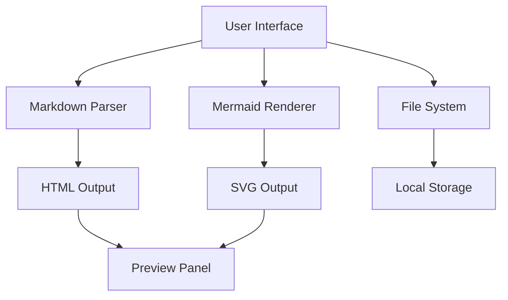

# Architecture

## Overview

The architecture follows a clean separation between the editor,
parser, and rendering components. The UI layer orchestrates the
flow of data from user input through parsing to visual output.
