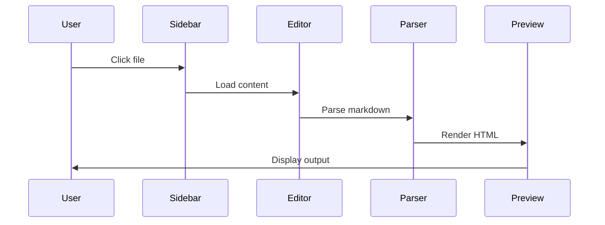

# File Open Sequence

## Description

This sequence diagram shows the flow when a user opens a file
from the sidebar. The content is loaded into the editor, parsed
into HTML, and rendered in the preview panel.
