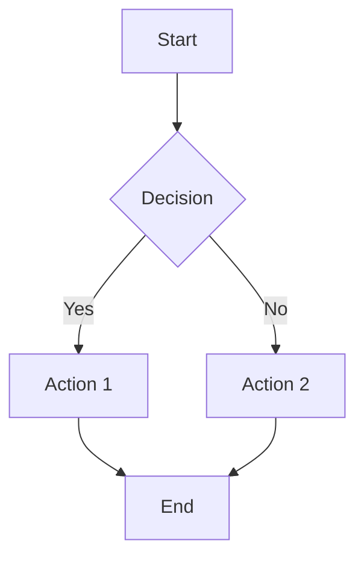

# Test Workspace

This is a fixture workspace for MarkAmp E2E tests.
It includes various markdown features for testing.

## Headings

### Level 3 Heading

#### Level 4 Heading

##### Level 5 Heading

## Lists

- Item one
- Item two
  - Nested item
- Item three

1. First
2. Second
3. Third

## Links and Images

[Example Link](https://example.com)

## Code

Inline `code` example.

```javascript
function hello() {
  console.log("Hello, World!");
}
```

```python
def greet(name):
    return f"Hello, {name}!"
```

## Tables

| Name    | Language   | Stars  |
| ------- | ---------- | ------ |
| MarkAmp | C++        | 1000   |
| VSCode  | TypeScript | 150000 |

## Task Lists

- [x] Build the app
- [ ] Write tests
- [ ] Release

## Blockquotes

> This is a blockquote
> with multiple lines.

## Mermaid Diagram



## Emphasis

This is **bold** and this is _italic_ and this is ~~strikethrough~~.

## Horizontal Rule

---

## Footnotes

Here is a footnote reference[^1].

[^1]: This is the footnote content.
